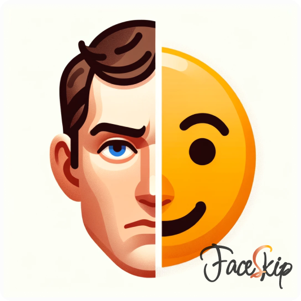

# FaceSkip

  

### FaceSkip 오프라인 버전 개발을 위한 코드 저장소입니다. 

초기 버전은 DeepFace 모델을 기반으로 Flutter를 활용한 모바일 어플리케이션으로 만들었으나, 
개발 공부도 할 겸, 별도의 FER 모델을 파인튜닝하여 오프라인 버전으로 다시 만들어 볼 예정입니다.

기본적으로는 Jupyter Notebook을 활용하여 개발할 예정이며, 필요에 따라 Python 파일이 업로드 될 수도 있을 것 같습니다.

개발과 모델 학습 간에 사용하는 데이터나 이미지 등은 Dall.E를 통해 생성하거나 오픈 라이센스로 공유되고 있는 것들만 사용할 예정입니다. (오픈 라이센스 자료들은 하단에 출처를 남깁니다.)

되도록 Daily commit을 지향하고는 있으나, 조금 밀리더라도 차근차근 구현해보도록 하겠습니다.

*※ 본 README는 개발이 진행됨에 따라 수정될 수 있습니다.*

## Reference
[1] FER2013 Dataset(Dumitru, Kaggle): https://www.kaggle.com/c/challenges-in-representation-learning-facial-expression-recognition-challenge/rules